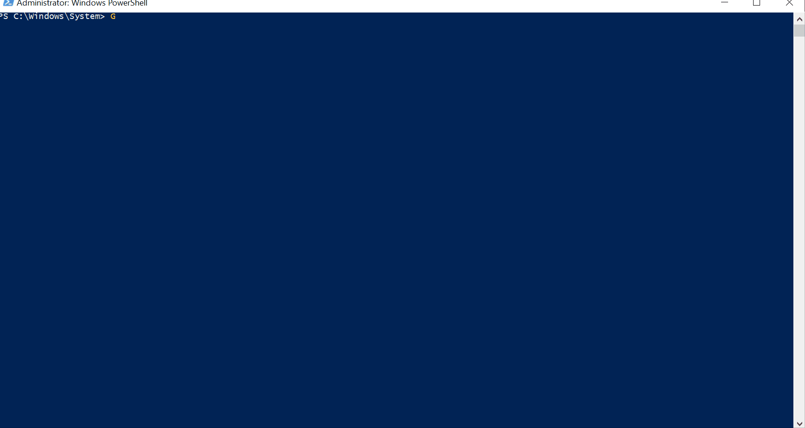

# Get-O365IPAddress

## SYNOPSIS  
The function gets the Office 365 IP address & URL information.

## DESCRIPTION
The function gets the Office 365 IP address & URL information, in XML format, and returns the Product (O365, SPO, etc...), AddressType (IPV4,IPV6, OR URL), and Address (Ex: 13.107.6.152/31) information.

## NOTES  
  - **File Name**   : Get-O365IPAddress.ps1
  - **Author**      : Thomas ILLIET, contact@thomas-illiet.fr
  - **Date**	    : 2017-10-23
  - **Last Update** : 2017-10-23
  - **Test Date**   : 2017-10-23
  - **Version**	    : 1.0.0 

## LINK
  - Invoke-WebRequest
  - https://support.office.com/en-us/article/Office-365-URLs-and-IP-address-ranges-8548a211-3fe7-47cb-abb1-355ea5aa88a2
  - https://support.content.office.net/en-us/static/O365IPAddresses.xml
  - https://github.com/thomas-illiet/Powershell/tree/master/Office365/Other/Get-O365IPAddress