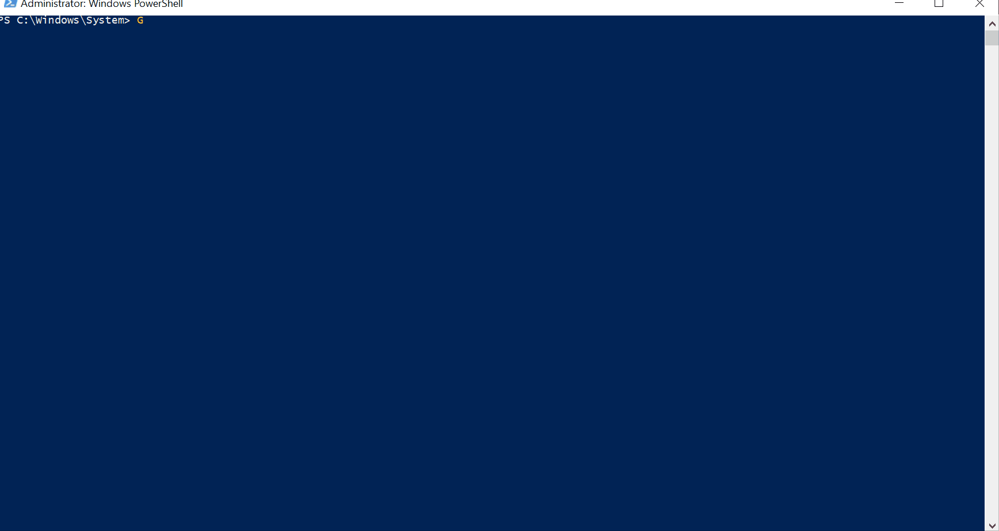

# Get-O365IPAddress



## SYNOPSIS  
This script gets the Office 365 IP address & URL information.

## DESCRIPTION
This script gets the Office 365 IP address & URL information, in XML format, and returns the Product (O365, SPO, etc...), AddressType (IPV4,IPV6, OR URL), and Address (Ex: 13.107.6.152/31) information.

## NOTES  
  - **File Name**   : Get-O365IPAddress.ps1
  - **Author**      : Thomas ILLIET, contact@thomas-illiet.fr
  - **Date**        : 2017-10-23
  - **Last Update** : 2017-10-23
  - **Test Date**   : 2017-10-23
  - **Version**     : 1.0.2

## INSTALL
```
PS> Install-Script -Name Get-O365IPAddress
```

## EXAMPLE
```
PS> Get-O365IPAddress

Addresses                                                      AddressType Product
---------                                                      ----------- -------
{2603:1020:200::682f:a1d8/128, 2603:1020:201:a::2b1/128, ...}  IPv6        o365
{13.64.196.27/32, 13.64.198.19/32, 13.64.198.97/32, ...}       IPv4        o365
{*.aadrm.com, *.activedirectory.windowsazure.com, ...}         URL         o365
```

## LINK
  - Invoke-WebRequest
  - https://support.office.com/en-us/article/Office-365-URLs-and-IP-address-ranges-8548a211-3fe7-47cb-abb1-355ea5aa88a2
  - https://support.content.office.net/en-us/static/O365IPAddresses.xml